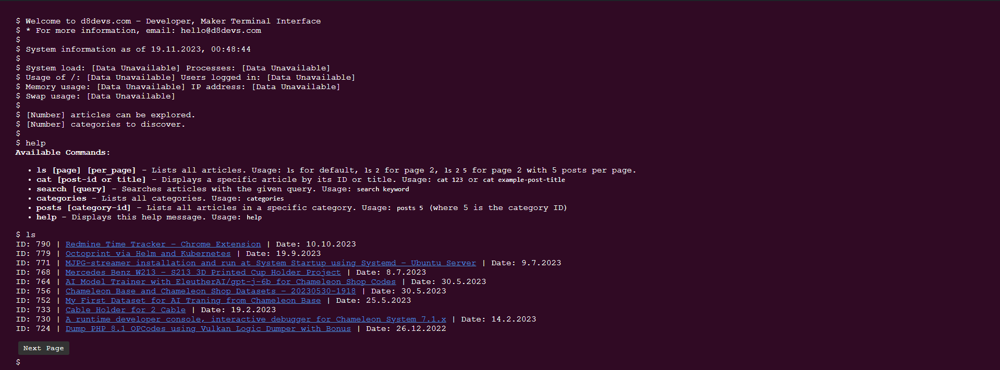

# D8 Linux Terminal Theme for WordPress

## Description
The D8 Linux Terminal Theme is a unique WordPress theme that emulates the look and feel of a Linux terminal. This theme is perfect for tech enthusiasts and those who love the classic terminal aesthetic.

## Features
- **Terminal-like Interface**: The theme offers a command-line interface style, making your WordPress site look like a Linux terminal.
- **Dynamic Content Loading**: Fetches posts, categories, and more using AJAX, providing a seamless user experience.
- **Interactive Commands**: Users can interact with your website using terminal commands.
- **Social Media Integration**: Easy sharing of posts and categories on social media platforms like Twitter, Facebook, and LinkedIn.

## Screenshots

*The above screenshot gives you a glimpse of the unique terminal-like interface of the D8 Linux Terminal Theme.*

## Usage
The theme includes several custom commands that can be used to navigate and interact with the site:

- `ls [page] [per_page]`: Lists all articles with pagination support.
- `cat [post-id or title]`: Displays a specific article by its ID or title.
- `search [query]`: Searches articles with the given query.
- `categories`: Lists all categories.
- `posts [category-id]`: Lists all articles in a specific category.
- `help`: Displays a help message with available commands.

## Installation
To install the D8 Linux Terminal Theme on your WordPress site, follow these steps:

1. Download the theme as a ZIP file from the [GitHub repository](#).
2. Log in to your WordPress admin panel.
3. Go to `Appearance` > `Themes`.
4. Click on `Add New` and then `Upload Theme`.
5. Choose the downloaded ZIP file and click `Install Now`.
6. After the installation is complete, click `Activate` to apply the theme to your site.

## Contributing
Contributions to the D8 Linux Terminal Theme are welcome. Please feel free to fork the repository, make changes, and submit pull requests.

## License
This theme is licensed under the GNU General Public License v2 or later. For more details, see the [license file](http://www.gnu.org/licenses/gpl-2.0.html).

## Author
Developed by [d8devs](http://d8devs.com). Visit our [website](http://d8devs.com/d8-linux-terminal-wordpress-theme) for more information.

