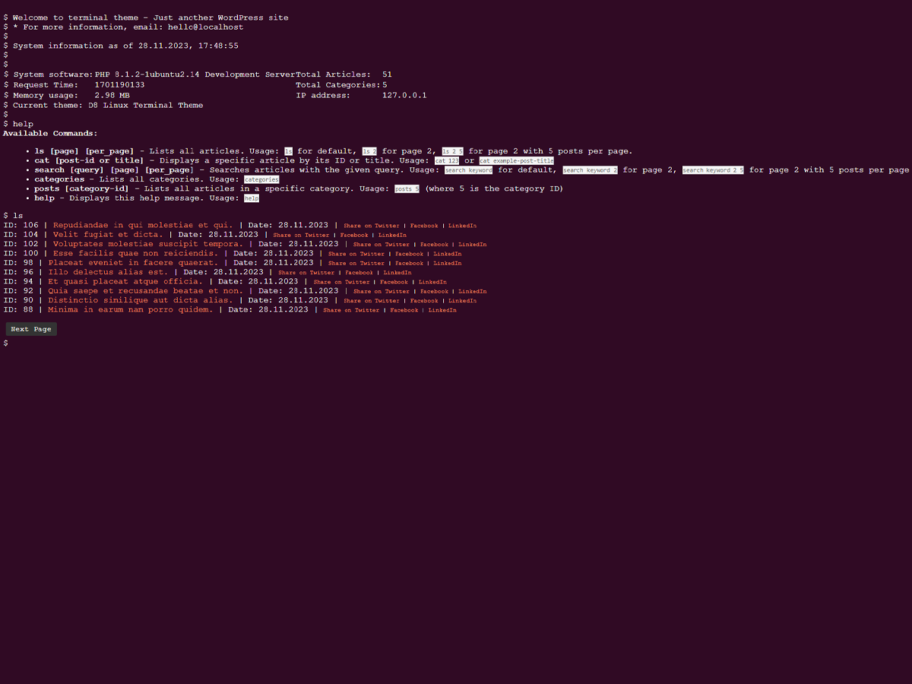

# D8 Linux Terminal Theme

## Description
The D8 Linux Terminal Theme is a unique, terminal-like theme designed for WordPress websites. It's ideal for tech enthusiasts, bloggers, and anyone who loves the classic Linux terminal aesthetic.

## Features
- **Terminal-like Interface**: Emulates the look and feel of a Linux terminal.
- **Dynamic Content Loading**: Fetches posts, categories, and more using AJAX for a seamless experience.
- **Interactive Commands**: Users can navigate and interact with your website using terminal commands.
- **Social Media Integration**: Facilitates easy sharing of posts and categories on platforms like Twitter, Facebook, and LinkedIn.

## Screenshots

*The screenshot above showcases the unique terminal-like interface of the D8 Linux Terminal Theme.*

## Usage
The theme includes custom commands for site navigation and interaction:

- `ls [page] [per_page]`: Lists articles with pagination.
- `cat [post-id or title]`: Displays a specific article.
- `search [query]`: Searches articles.
- `categories`: Lists all categories.
- `posts [category-id]`: Lists articles in a specific category.
- `help`: Shows available commands.

## Installation
To install the D8 Linux Terminal Theme:

1. Download the theme: [D8 Linux Terminal Theme v1.0.0](https://github.com/kzorluoglu/d8terminal/releases/tag/1.0.0)
2. Log in to your WordPress admin panel.
3. Navigate to `Appearance` > `Themes`.
4. Click `Add New` > `Upload Theme`.
5. Select the downloaded ZIP file and click `Install Now`.
6. After installation, click `Activate`.

## Contributing
Contributions are welcome. Feel free to fork the repository, make changes, and submit pull requests.

## License
Licensed under the GNU General Public License v2 or later. See [license details](http://www.gnu.org/licenses/gpl-2.0.html).

## Author
Developed by [d8devs](http://d8devs.com). For more information, visit our [website](http://d8devs.com/d8-linux-terminal-theme).
